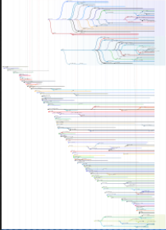

<!-- $theme: default -->
<!-- page_number: true -->

Introduction à Linux
====

**MIEC211 - Module 3**

-- 
Alix Chagué

*alix.chague@uvsq.fr*
*IECI - Université Versailles Saint-Quentin*

---

# Objectifs du cours
- comprendre ce qu'est un système informatique et ce qui le compose
- comprendre ce qu'est un système d'exploitation
- savoir effectuer des actions de bases sur Linux

---
# Plan des séances
### 22 mars :
- systèmes informatiques et  systèmes d'exploitation 
- présentation de Linux

### 29 mars : 
- prise en main de Linux

---
# Evaluation
- une évaluation sur table le 29 mars (notée du 10)
- un TP le 29 mars (noté sur 10)

---

# Systèmes informatiques

---
## Systèmes informatiques

Le `système informatique` désigne un ensemble informatique composé de parties visibles et physiques (*ex: un écran*), de parties immatérielles affichées ou non (*ex: des fichiers*) et de concepts qui guident son organisation (*ex: l'organisation des données sous la forme de fichiers et de dossiers*).

> Un système informatique peut-être "embarqué" ou produit sous la forme de PC (*Personal Computer*).

> Ordinateurs, smartphones, GPS, lecteurs MP3, montres connectées (etc) sont des systèmes informatiques.

---

## Anatomie d'un système informatique (1)

- On appelle `hardware` l'environnement **matériel** (mécannique, électronique...) d'une machine de type ordinateur ou *smartphone*.

- On appelle `software` les logiciels, programmes et applications permettant le fonctionnement d'un système informatique, y compris sa documentation. Ils sont **immatériels**.

---
## Anatomie d'un système informatique (2)

> [voir le détail des composants d'un smartphone ici](http://www.vie-et-paysages.org/images/Divers/Expo_FNE_metaux_smartphone.jpg)

---
## Anatomie d'un système informatique (3)

| *Hardware*  | *Software*  |
| :---------: | :---------: |
| Carte-mère, processeurs, écran, clavier, boîtier, etc. | Unix, Shell, Codecs vidéos, Photoshop, Firefox, système d'exploitation, etc. |

---

# Systèmes d'exploitations 

---

> Quelle est la différence entre Microsoft et Windows ?

---

## Les systèmes d'exploitation - SE (1)

Principaux SE connus : 

-
- 
-
-
-

---

## Les systèmes d'exploitation - SE (1)

Principaux SE connus : 

- Windows
- Mac OS
- Linux
- Android
- iOS

---

## Les systèmes d'exploitation - SE (2)

Les `systèmes d'exploitation` sont des environnements informatiques permettant de faire fonctionner ensemble les composants matériels d'une machine et lui permettant d'exécuter programmes et applications.  

Le système d'exploitation est en quelque sorte le pilote de la machine, sans lui, les logiciels ne peuvent pas être exécutés. 

---

| Logiciels et applications | Système d'exploitation | Composants matériels |
| :-----------------------: | :--------------------: | :------------------: |

---

## Point vocabulaire

- en anglais on parle d'`Operating System` ou `OS` pour désigner le système d'exploitation
- `utilitaires` : un groupe de logiciels sépcifiques assurant les services de base aux utilisateur.rice.s (ex : interface graphique, interpréteur de commandes, gestionnaires de tâches ou de fichiers)

---

## Systèmes d'exploitation propriétaires (1)

Les systèmes d'exploitation les plus répandus sur les ordinateurs personnels sont des systèmes propriétaires. 

Un `système d'exploitation propriétaire` ne permet pas légalement ou techniquement l'accès à son code source, la libre distribution de copies avec ou sans modification, et sa libre utilisation pour tous les usages. Le plus souvent, ces systèmes sont payants.

---
## Systèmes d'exploitation propriétaires (2)

- Microsoft produit **`Windows`**
- Apple produit **`Mac OS`**

Ces deux systèmes changent au grès de différentes **versions** dont les **fonctionnalités** évoluent : 
- Chez Windows : `2000`, `XP`, `Vista`, `8`, `10`, etc.
- Chez Apple : `OS X`, `macOS Sierra`, `macOS Mojave`, etc.

---

## Exemple de l'évolution des versions de Windows 

---

---

## Systèmes d'exploitation libres 

A l'inverse des SE propriétaires, les `systèmes d'exploitation libres` rendent leur code source accessible à tou.te.s et il est possible de les redistribuer, avec ou sans modification. 

Les SE basés sur Linux sont libres. La plupart sont gratuits mais il en existe aussi des versions commerciales. 

Tous les SE libres ne sont pas exclusivement basés sur Linux.

---

## Historique de Linux (1)

1. **Entre 1960 et 1990** : profusion de solutions de SE compatibles avec certains processeurs uniquement. 
- `UNIX` : famille de SE dérivés du projet `UNICS` (*Uniplexed Information & Computing Service*) lancé en **1960** sous la direction de Kenneth Thompson (US) dans les laboratoires d'AT&T (*Bell Labs*). 

---

## Historique de Linux (2)

1. **Entre 1960 et 1990** : profusion de solutions de SE compatibles avec certains processeurs uniquement. 
- `UNIX` : famille de SE dérivés du projet `UNICS` (*Uniplexed Information & Computing Service*) lancé en **1960** sous la direction de Kenneth Thompson (US) dans les laboratoires d'AT&T (*Bell Labs*).

2. **Entre 1980 et 1990** : émergence des deux principaux acteurs des systèmes propriétaires actuels, Microsoft et Apple.

---

## Historique de Linux (3)

1. **Entre 1960 et 1990** : profusion de solutions de SE compatibles avec certains processeurs uniquement. 
- `UNIX` : famille de SE dérivés du projet `UNICS` (*Uniplexed Information & Computing Service*) lancé en **1960** sous la direction de Kenneth Thompson (US) dans les laboratoires d'AT&T (*Bell Labs*).

2. **Entre 1980 et 1990** : émergence des deux principaux acteurs des systèmes propriétaires actuels, Microsoft et Apple.

3. **1983** : lancement du projet `GNU` par ==Richard Stallman== (US), un SE libre alternatif à UNIX.

---

## Historique de Linux (4)

1. **Entre 1960 et 1990** : profusion de solutions de SE compatibles avec certains processeurs uniquement. 
- `UNIX` : famille de SE dérivés du projet `UNICS` (*Uniplexed Information & Computing Service*) lancé en **1960** sous la direction de Kenneth Thompson (US) dans les laboratoires d'AT&T (*Bell Labs*).

2. **Entre 1980 et 1990** : émergence des deux principaux acteurs des systèmes propriétaires actuels, Microsoft et Apple.

3. **1983** : lancement du projet `GNU` par ==Richard Stallman== (US), un SE libre alternatif à UNIX.

4. **1991** : création du noyau `Linux` par ==Linus Torvalds== (FI) inspiré du fonctionnement de UNIX. 

---
## Deux figures clefs des SE libres 

|Linus Torvalds|Richard Stallman|
|:--:|:--:|
|||

---

## Linux

|  |
| :-----------------------: |
| Au sens strict, Linux est un `noyau de système d'exploitation` (aussi appelé "kernel"). Sa fonction est d'interragir avec les composants matériels (processeur, mémoire, périphériques, ...) en assurant la communication entre ces derniers et les logiciels. | 

---
## GNU

|  | 
| :-----------------: |
| GNU correspond à la `couche logicielle` du système d'exploitation, notamment les utilitaires, mais sans noyau. |
| GNU est aussi un projet de système d'exploitation complet et libre mené par la *Free Software Fondation* (FSF). |

---
## Le système GNU+Linux : stabilisé en 1992

|  |
| :----------------------------: |
| Au sens large, Linux est le système d'exploitation libre résultant de la combinaison de GNU et du noyau Linux (`GNU/Linux` ou `GNU+Linux`), voire n'importe quel SE basé sur le noyau Linux. |

---

# Distributions Linux

---
## Distributions GNU+Linux (1)

On trouve le système GNU+Linux sous plusieurs formes, que l'on appelle `distributions`.

| |  |
| :---: | :--- |
||  Elles se différencient par leurs spécificités techniques (logiciels disponibles, fréquence de MàJ, etc) et leur philosophie de développement. |

---

## Distributions GNU+Linux (2)

|| |
|:---:| ---|
|  | Une distribution peut être développée à partir d'une autre distribution parente, on parle alors de `fork`. |

Il existe alors plusieurs `familles de distributions`, qui partagent
à des degrés divers une communauté, une philosophie et/ou des caractéristiques techniques. 

---

## Distributions GNU+Linux (3) 

Il existe des dizaines et des dizaines de distributions différentes du système GNU+Linux. ==Slackware==, ==RedHat== et ==Debian== en sont les trois principales `distributions mères`. Elles apparaissent dès 1993 sous la forme de projets qui aboutissent à des formes stables plus ou moins rapidement (respectivement 1993, 1995, 1998).

.

> Arbre des distributions GNU+Linux : https://upload.wikimedia.org/wikipedia/commons/1/1b/Linux_Distribution_Timeline.svg

---

## Familles de distributions GNU+Linux

| Famille Debian | Famille Slackware | Famille RedHat | Autres, dont Android* |
| - | - | - | - |
|  |  |  |  |
| | | | |

\* *Android n'est pas a proprement parler une distribution GNU+Linux.*

---
## Quelques distributions GNU+Linux

| debian | ubuntu | Mint | raspbian |  
| :--: | :--: | :--: | :--: |
|  |  |  |  | 
| **redhat** | **fedora** | **mageia** | **android** |
|  |  |  |  |

---

## Environnements de bureau

L'ensemble logiciel du système d'exploitation gérant l'==interface graphique== est appelé `environnement de bureau`. 

Il en existe également plusieurs dont :
- GNOME (GNU)
- KDE
- MATE
- Cinnamon

---

# Utiliser Linux

---

## Pourquoi ne pas utiliser Linux ?

- Je suis habitué.e à Windows/Mac ;
- C'est moche ;
- Personne n'utilise Linux / c'est marginal ;
- C'est trop technique / c'est pour les geeks ;
- Il faut l'installer soi-même ;
- Je ne sais pas quelle distribution choisir ;
- Tout ne fonctionne pas sous Linux ;

---

## Oui mais... 

- Windows est pré-installé sur 90% des ordinateurs personnels vendus en 2015 ;
- Windows est payant (W10 : 145€ en 2019) ;
- Windows donne peu de contrôle à l'utilisateur.rice ;
- Windows, c'est lourd et lent ;
- Mac est incompatible avec autre chose qu'Apple ;
- donc Mac, c'est cher ;
- Mac n'a pas tous les programmes ou a les siens propres ;

---

## Pourquoi utiliser Linux ?

- C'est gratuit ;
- Il y a des distributions très belles et proches des environnements graphiques de Windows ou Mac ;
- Il y a des distributions qui demandent peu de connaissances techniques,  dotées d'une vraie documentation et d'une communauté active pour aider ;
- Il y a des distributions très compatbiles avec la plupart des applications utilisées sous Windows ; 
- L'installation est rapide et permet de "ressusciter" des vieux ordinateurs ;
- Avec Linux c'est l'utilisateur.rice qui a le contrôle ;

---
## En plus...

Linux n'est pas si marginal car : 
- Android (noyau Linux) équipe plus de 80% des smartphones vendus actuellement.
- Près des 2/3 des serveurs pour le web utilisent une distribution Linux ou proche.

---

# Installation de Linux

---

## Installer Linux

- On installe Linux depuis une `clef USB` ou un `CD` dits "*bootable*" ;
- On peut écraser le système d'exploitation installé avant, ou faire un `dual boot`, c'est-à-dire installer deux (ou +) système d'exploitation sur un même disque dur, en faisant des `partitions` ;
- On peut simuler un SE Linux sur Windows ou Mac en utilisant une `machine virtuelle` (avec le logiciel ==Virtual Box== par exemple).

---

### Démo d'installation

---

## Tester Linux en ligne
|                                                 |
| :---------------------------------------------- |
| **Simulateur de terminal sous Linux**           |
| https://bellard.org/jslinux/vm.html?url=https://bellard.org/jslinux/buildroot-x86.cfg |
| **Démo de l'environnement Ubuntu**              |
| http://tour.ubuntu.com/en/                      |

---

# Récapitulons

---

> Quelle sont les différences entre Windows, Mac et Linux ?

---

> Quelle est la différence entre GNU et Linux ?

---

> Quelle est la différence entre Debian et Ubuntu ?

---

### Bibliographie du cours

https://www.zotero.org/groups/2281857/intro_linux
