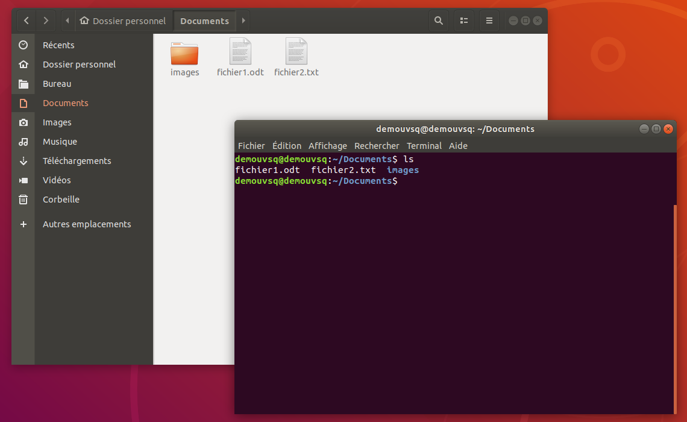

<!-- $theme: default -->
<!-- page_number: true -->

Introduction à Linux
====

**MIEC211 - Module 3**


-- 
Alix Chagué


*alix.chague@uvsq.fr*
*IECI - Université Versailles Saint-Quentin*

---

# Evaluation

---

# Correction de l'évaluation

---

# Prise en main de Linux

---

## Interfaces

> Dispositif qui permet la communication entre deux éléments / entre l'utilisateur et les outils
---

### Interface graphique / Ligne de commande



---

### Interface graphique

Une `interface graphique` correspond à un affichage **symbolique** où les objets manipulés sont dessinés (pictogrammes) à l'écran, de manière à imiter la manipulation physique de ces objets avec généralement un dispositif de pointage (ex : souris).

> aussi appelée GUI (pour *graphical user interface*)
> elles apparaissent à partir de 1970

---

### Interface en ligne de commande

Une `interface en ligne de commande` correspond à une interface dans laquelle la communication entre l'utilisateur.rice et l'ordinateur se fait en mode texte. 

> aussi appelée CLI (pour *command line interface*)

L'`invite de commande` (ou `prompt`) correspond au début d'une ligne permettant à l'utilisateur.rice d'entrer une commande. Elle se termine par un caractère précis : `#`, `$` ou encore `>`.  


---

### Interfaces

L'interface graphique est la plus commune aux utilisateur.rices de base, elle est plus simple à utiliser (intuitive). 

La ligne de commande est plus puissante et permet de réaliser certaines tâches plus rapidement. Elle change peu d'un OS ou d'une distribution à l'autre.

> Ex : Modifier les extensions de plusieurs fichiers :
> -  en GUI plusieurs tâches à répéter ;
> - en CLI une seule commande pour tous les fichiers. 

.
==La distinction GUI/CLI n'est pas propre à Linux !==

---
Pour cette initiation à Linux, nous nous concentrons sur la prise en main de l'interface en ligne de commande. 

---

## Gestion des utilisateur.rice.s 

---

### Système multi-utilisateur.rice.s

Linux étant un `système multi-utilisateur.rice.s`, plusieurs personnes peuvent utiliser une même machine en même temps.

Comme sur Windows et macOS, Linux fonctionne sur le principe de `sessions` d'utilisateur.rice.s.

A l'inverse de l'interface graphique, la ligne de commande permet une grande souplesse dans la gestion des autorisations et des utilisateur.rice.s.

---

### Principes généraux : utilisateur.rice.s

Un.e utilisateur.rice :
- possède un nom (`login`) + un `mot de passe`
- est rattaché à un ou plusieurs `groupe(s)`
- possède des `droits` qui lui sont associés
- possède des `droits` par l'intermédiaire des groupes auxquels ielle appartient

Un.e utilisateur.rice peut être le/la `propriétaire` d'un fichier.

---

### Principes généraux : groupes

Les groupes facilitent la gestion des droits.
- Il peut exister plusieurs groupes sur une même machine.
- Plusieurs utilisateur.rice.s peuvent être associé.e.s à un groupe.
- Un.e utilisateur.rice peut être associé.e.s à plusieurs groupes.

Chaque groupe est associé à :
- un nom
- une liste d'utilisateur.rice.s
- des droits

---

### Principes généraux : droits

Un fichier ou dossier peut être :
| droit | code | valeur arithmétique  |
| -- | -- | -- |
| LU | ==R==ead | 4 |
| ECRIT | ==W==rite | 2 |
| EXÉCUTÉ\* | e==X==ecute | 1 (\**seulement pour les fichiers!*)| 

Les droits activés sur un fichier ou un dossier sont résumés sous la forme d'une valeur comprise entre 0 et 7 correspondant à l'addition des valeurs arithmétiques des droits activés. 

---

### Principes généraux : modes

Trois catégories d'utilisateur.rice.s sont associés à un fichier ou dossier. Le `mode` d'un fichier est exprimé sous la forme d'un nombre à trois chiffres.


| Propriétaire                | Groupe               | Autres      | 
| :-------------------------: | :------------------: | :---------: |
|      7                      |    5                 |   0         |
| 4 + 2 + 1                   | 4 + 1                |             |
| R + W + X                   | R + X                |             |
| lecture, écriture, exécution| lecture et exécution | aucun droit |

---

### Principes généraux : modes (2)


.

On change le mode du fichier ou dossier avec la commande `chmod` et son/sa propriétaire avec `chown`. 


---
### Principes généraux : super utilisateur
Il existe un ==super utilisateur== :
- nommé `root`
- que l'invite de commande signale avec le symbole : `#`

Mais !

- `root` est dangereux car ce mode utilisateur a tous les droits
- mieux vaut **ponctuellement** utiliser les pouvoirs de root en invoquant le `sudo` (super-doer) 
- `sudo` équivaut à l'**exécution en mode administrateur** de Windows 

---

## Manipulations en ligne de commande

---

### Tricks

- autocomplétion : `Tab`
- circuler dans la ligne : `←` `→`
- faire défilier l'historique des commandes : `↑` `↓`
- copier : `Ctrl`+ `Maj`+`C`
- coller : `Ctrl`+ `Maj`+`V`
- interrompre une tâche : `Ctrl`+`C`

---

### Utilitaires en ligne de commande

L'interface en ligne de commande intègre des utilitaires comme :
- gestionnaire des tâches
- éditeur de texte
- gestionnaire de paquets
- ...

---

### Gestionnaire des tâches

```
top
```

Permet de surveiller l'état de la mémoire, la charge portée sur le processeur et les processus en cours. 

---
### Editeur en ligne de commande

```
vim
```

```
nano
```

Permettent d'ouvrir un fichier de texte et de l'éditer puis de sauvegarder les modifications. 

Plus ancien, `vim` (1991) est moins intuitif que `nano` (2000) qui est donc plus facile à utiliser.

---

## Installer des logiciels

---
### Spécificités de Linux

Windows et macOS ne gèrent pas l'installation des logiciels de la même manière, Linux non plus. 

Il y a trois manières d'installer un logiciel sur Linux :
- télécharger un dossier (archive) et exécuter un fichier (.sh) qui lance le programme
- compiler un ensemble de scripts pour créer un exécutable
- ==utiliser un gestionnaire de paquets==

---
### Gestionnaire de paquets (1)

Le gestionnaire de paquets est un utilitaire.

Il existe en mode graphique et en ligne de commande.

##### Sur Debian (en dérivés) : on utilise `aptitude`
Comme il touche à des éléments essentiels du fonctionnement de la machine, `aptitude` requiert généralement d'être utilisé en mode `superutilisateur`. 


``` 
sudo apt 
```

---
### Gestionnaire de paquets (2)

Installer un paquet ou logiciel : 
``` sh
sudo apt-get install <nom_du_logiciel>
```

Désinstaller un paquet ou logiciel : 
``` sh
sudo apt-get remove <nom_du_logiciel>
```

Chercher des mises à jour et mettre à jour les logiciels :
``` sh
sudo apt-get update

sudo apt-get upgrade
```
---

## Commandes

---

### Forme d'une commande : 

Une commande est donnée en invoquant le nom d'un utilitaire ou d'un logiciel. Elle peut être complétée de sous-commande(s), d'arguments ou d'options, dans un ordre qui varie.

``` sh
nom_de_commande [sous-commandes] [-argument] [options]
```
Par exemple :
``` sh
user:~$ ls -al

user:~$ less fichier.txt

user:~$ git commit -m "ceci est un commit" 
```

---
### Manuel d'utilisation

Pour savoir comment bien invoquer une commande, il est essentiel de lire la documentation. 

Elle est affichée avec l'argument `--help` ou `-h`:

```sh
<commande> -h

<commande> --help
```

Ou, lorsqu'il est disponible, en utilisant l'utilitaire `man` qui permet d'afficher le manuel d'utilisation :
``` sh
man <commande>
```

---

### Manuel d'utilisation

Comme parfois `help` ou `man` ne suffisent pas, il peut être utile de consulter la documentation supplémentaire fournie sur internet. 

---

## Un peu de pratique

